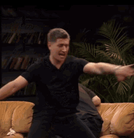

# dynamic avatar (dava)

- get current weather from https://open-meteo.com/
- create prompt to generate new avatar based on base image and weather conditions with help of https://stablediffusionweb.com/ru
- upload it to telegram
- profit



## run

- create .env file
```properties
cookies=cookies to auth in https://stablediffusionweb.com/ru
image_dir=images
prompt_text = Ultra-realistic portrait of the same person from reference image, maintaining exact facial features, hairstyle and core expression. The person is situated in {place} during {detailed_description}. Background shows {environmental_details} with appropriate landmarks or scenery of {place}. {lighting_description} creating {mood_description} atmosphere. The person wears {clothing} while maintaining their signature style from original image. Environmental effects: {weather_effects}. Photorealistic, 8K detail, cinematic environmental lighting, perfect skin texture, realistic fabric details, hyper-detailed eyes.
place=Moscow
api_id= read https://docs.telethon.dev/en/stable/basic/signing-in.html how to get api_id and api_hash
api_hash=
latitude=55.7522
longitude=37.6156
timezone=Europe/Moscow
```
- create `logs` folder
- create `images` folder
- place base image into `images` called `avatar.jpg`

```bash
uv run avatar_updater.py
```
