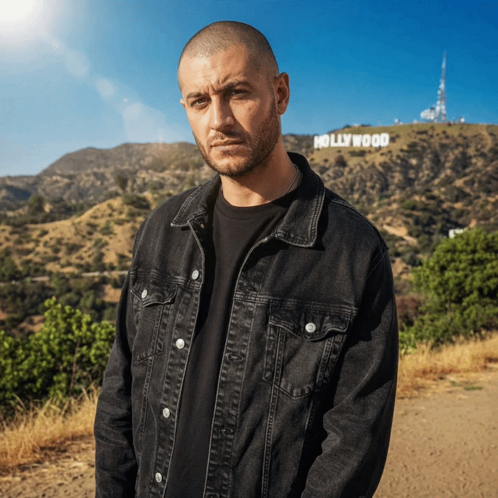

# dynamic avatar (dava)

- get current weather from https://open-meteo.com/
- create prompt to generate new avatar based on base image and weather conditions with help of image generators
- upload it to telegram via Secretary Mode (Chat Automation)
- optionally generate **video profile photos** on holidays and extreme weather using Veo 3.1 Fast
- profit



## setup

### 1. Telegram Bot Setup

1. Create a bot via [@BotFather](https://t.me/BotFather) if you don't have one
2. In @BotFather, enable **Secretary Mode** for your bot:
   - Go to your bot's settings → **Secretary Mode** → Enable
3. In the Telegram app, go to **Settings > Chat Automation** and connect your bot
   - Grant the **Edit Profile Photo** permission when connecting
4. Note your `allowed_chat_id` (your user ID) — you can get it by messaging [@userinfobot](https://t.me/userinfobot)

### 2. Configuration

Create a `.env` file:

```properties
# Required for all generators
image_dir=images
prompt_text=Ultra-realistic portrait of the same person from reference image, maintaining exact facial features, hairstyle and core expression. The person is situated in {place} during {detailed_description}. Background shows {environmental_details} with appropriate landmarks or scenery of {place}. {lighting_description} creating {mood_description} atmosphere. The person wears {clothing} while maintaining their signature style from original image. Environmental effects: {weather_effects}. Photorealistic, 8K detail, cinematic environmental lighting, perfect skin texture, realistic fabric details, hyper-detailed eyes.
place=Moscow
api_id=read https://docs.telethon.dev/en/stable/basic/signing-in.html how to get api_id and api_hash
api_hash=
latitude=55.7522
longitude=37.6156
timezone=Europe/Moscow
bot_token=your_bot_token_from_botfather
allowed_chat_id=your_telegram_user_id
previous_prompt_text="will not update photo if prompt hasn't changed"

# Image generator: stable-diffusion, nano-banana, or nano-banana-2
image_generator=stable-diffusion

# Stable Diffusion settings (required if image_generator=stable-diffusion)
cookies=cookies to auth in https://stablediffusionweb.com/ru
image_cfg_scale=0.6
style=sai-photographic

# Polza.ai settings (required if image_generator=nano-banana or nano-banana-2)
polza_api_key=your_polza_api_key
# polza_model=google/gemini-2.5-flash-image   (optional override, defaults based on image_generator)
```

#### Image Generators

| Generator | `image_generator` value | Model | Description |
|-----------|------------------------|-------|-------------|
| Stable Diffusion | `stable-diffusion` | SD-XL | Uses stablediffusionweb.com (requires `cookies`) |
| Nano Banana | `nano-banana` | `google/gemini-2.5-flash-image` | Uses Polza.ai API (requires `polza_api_key`) |
| Nano Banana 2 | `nano-banana-2` | `google/gemini-3.1-flash-image-preview` | Polza.ai, 4K support (requires `polza_api_key`) |
| Hermes / xAI Grok | `hermes` | Real xAI Grok Imagine (dedicated OAuth) | Calls https://api.x.ai directly using a dedicated token obtained via `scripts/init_xai_auth.py`. Automatic refresh, independent of Hermes Agent. |

You can also override the Polza model by setting `polza_model` to any model ID supported by Polza.ai (e.g. `google/gemini-2.5-flash-image`).

#### Video Generation

The bot can also generate **video profile photos** using Veo 3.1 Fast via the Polza.ai API. Video generation is triggered automatically on:

- **Holidays** — Russian public holidays and Friday the 13th
- **Extreme weather** — thunderstorms, heavy rain/snow, hail, etc. (weather codes with actions in `video_actions.weather`)

Video settings are seeded with sensible defaults in the database and can be configured via the bot's interactive menu (recommended) or commands:

| Setting | Config key | Type | Description |
|---------|-----------|------|-------------|
| Video mode | `video_mode` | `auto` or `never` | `auto` generates video on triggers; `never` disables it. Default: `auto` |
| Video actions | `video_actions` | dict | Maps weather codes and holiday names to action descriptions for the prompt |
| Video prompt | `video_prompt_text` | string | Template for video prompts (primarily action/motion). A contextual reference image (generated or cached from the normal static prompt) is passed to the video model and used for the video cache key. Default: `"{action}"` |

**Recommended**: Use **/settings** — it now shows a clean grouped summary of your current values and opens category menus (📍 Location, ✍️ Prompts, 🎥 Video, 📅 Schedule, 🌦️ Overrides, 👑 Admin). Far fewer buttons and values are visible immediately.

For video actions you can also use the convenient helpers (no giant JSON paste required):
- `/set_action weather|holiday <code> "action description here"`
- `/delete_action weather|holiday <code>`

Use the `/video_mode` bot command (or the toggle buttons inside /settings → 🎥 Video) to toggle video generation on/off.

**System requirements**: `ffmpeg` must be installed — it's used to crop video from 9:16 to 1:1 and truncate to 3 seconds for Telegram compatibility.

### 3. Run

- create `logs` folder
- create `images` folder
- place base image into `images` called `avatar.jpg`
- no phone login required — the bot uses Secretary Mode to update your profile photo

```bash
# First run: apply database migrations
uv run scripts/run_migrations.py

# Start the bot
uv run main.py
```

### How it works

Instead of logging into your personal Telegram account, the bot uses **Secretary Mode** (Chat Automation). When you connect the bot to your profile via Settings > Chat Automation, the bot receives a `business_connection_id` with the `edit_profile_photo` right. This allows the bot to update your profile photo directly through the Telegram API — no full account access needed.

For video avatars, the bot first ensures a contextual static reference image (using the normal image prompt + image cache, or generating if needed). This reference (not the raw base avatar) is passed to Veo 3.1 Fast as `REFERENCE_2_VIDEO` input and is also used for the video cache key (so different weather/holiday conditions produce different cache entries even with the same action text). The bot then generates a 9:16 video, uses `ffmpeg` to center-crop it to 1:1, truncate to 3 seconds, and strip audio. Telegram requires both a static frame (JPG) and the video file to set a video profile photo. `video_prompt_text` now focuses on action/motion; scene details come from the reference image.
## Hermes / xAI Grok generator (recommended for Grok models)

Set `image_generator=hermes` and/or `video_generator=hermes` to use **real xAI Grok Imagine endpoints** (`api.x.ai/v1/images/edits` and `/videos/generations`) with native Grok models.

**How it works**
- Run the one-time setup script **as the bot service user**:
  ```
  uv run scripts/init_xai_auth.py
  ```
  This performs a device-code OAuth login against xAI (SuperGrok / X Premium+) and writes a **dedicated** token pair for dava into `~/.dava/xai_auth.json` (or the path you configure).
- The bot now owns its own access + refresh tokens. It automatically refreshes them when they are close to expiry or when it receives a 401.
- This is completely independent from any Hermes Agent running on the same machine (avoids shared single-use refresh token races).

Advantages:
- Native Grok Imagine models (high quality reference-based image + video).
- No dependency on Hermes' token lifecycle or shared `~/.hermes/auth.json`.
- Automatic refresh + one retry on auth errors.

Configuration (admin / global_config):
- `xai_auth_path` — optional override (default `~/.dava/xai_auth.json`)
- `hermes_xai_image_model` — e.g. `grok-imagine-image-quality`
- `hermes_xai_video_model` — e.g. `grok-imagine-video-1.5-preview`

Example (via `/set_global_variable` or DB):
```
image_generator=hermes
video_generator=hermes
hermes_xai_image_model=grok-imagine-image-quality
```

After the initial `init_xai_auth.py` run, the bot will pick up the token automatically.

If you see persistent auth errors, re-run the init script to obtain a fresh dedicated grant.
```
